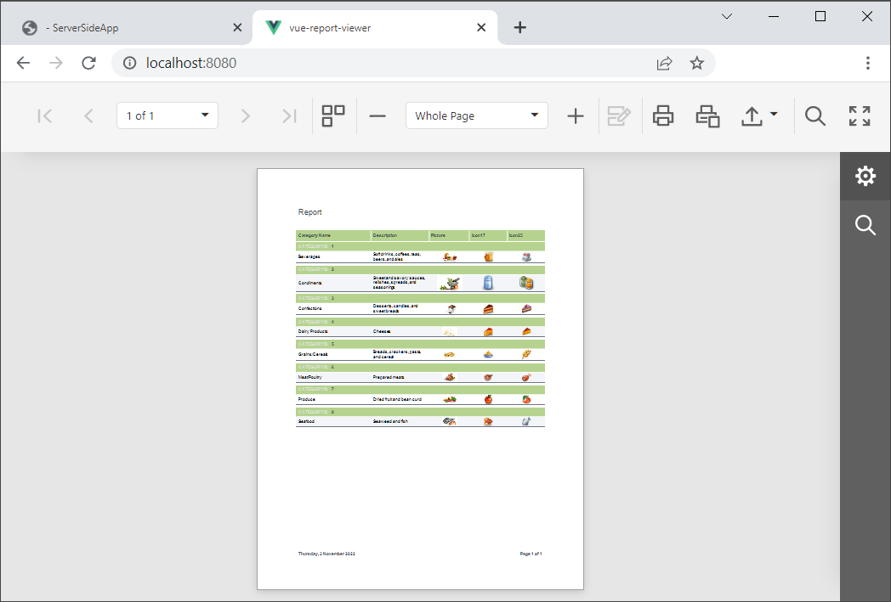

# Reporting for Web (Vue) - Document Viewer

This example consists of two parts: 

- A server (back-end) ASP.NET Core project that enables [cross-domain requests (CORS)](https://developer.mozilla.org/en-US/docs/Web/HTTP/CORS) (Access-Control-Allow-Origin) and implements a custom web report storage.

- An <a href="https://vuejs.org/">Vue JavaScript Framework</a> front-end client application.

Perform the following steps to run this example:

1. Open the back-end project solution (**CS/ServerSide.sln** or **VB/ServerSide.sln**) in Visual Studio and run the project.
2. Navigate to the **JS/vue-report-viewer** folder that is the client part's root folder.
3. Open the console and run the following command:

    ```npm install```
4. Run the command to compile and start the client part:

    ```npm run serve```

5. Point your browser to `http://localhost:8080/` to see the result.



## Files to Review

- [WebDocumentViewer.vue](JS/vue-report-viewer/src/components/WebDocumentViewer.vue)
- [main.js](JS/vue-report-viewer/src/main.js)
- [HomeController.cs](CS/ServerSideApp/Controllers/HomeController.cs)
- [CustomReportStorageWebExtension.cs](CS/ServerSideApp/Services/CustomReportStorageWebExtension.cs)
- [Startup.cs](CS/ServerSideApp/Startup.cs)

## Documentation

- [Document Viewer Integration in Vue](https://docs.devexpress.com/XtraReports/401539)
